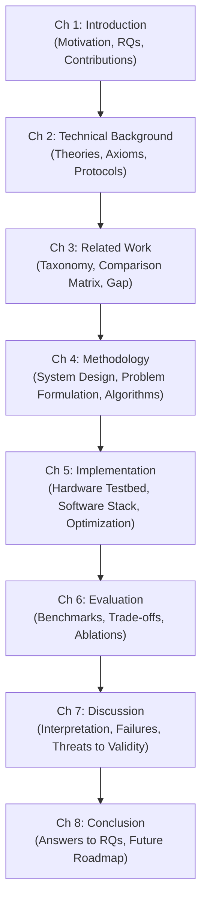

# Master's Thesis Guidelines & Structuring Recommendations
### Chair of Wireless Systems (Fachgebiet Drahtlose Systeme)
**Brandenburg University of Technology Cottbus–Senftenberg (BTU)**  
**Supervision**: Prof. Dr. rer. nat. Peter Langendörfer | Dr. rer. nat. Svetlana Meissner

---

## Table of Contents
1. [Overview & Scientific Standard](#1-overview--scientific-standard)
2. [Thesis Lifecycle & Milestones](#2-thesis-lifecycle--milestones)
3. [Recommended Thesis Structure (8 Chapters)](#3-recommended-thesis-structure-8-chapters)
4. [Chapter-by-Chapter Writing Guidelines](#4-chapter-by-chapter-writing-guidelines)
   - [Chapter 1: Introduction](#chapter-1-introduction)
   - [Chapter 2: Technical Background & Foundations](#chapter-2-technical-background--foundations)
   - [Chapter 3: Related Work & Taxonomy](#chapter-3-related-work--taxonomy)
   - [Chapter 4: Methodology & System Architecture](#chapter-4-methodology--system-architecture)
   - [Chapter 5: Implementation & Experimental Testbed](#chapter-5-implementation--experimental-testbed)
   - [Chapter 6: Empirical Evaluation & Benchmarks](#chapter-6-empirical-evaluation--benchmarks)
   - [Chapter 7: Critical Discussion & Threats to Validity](#chapter-7-critical-discussion--threats-to-validity)
   - [Chapter 8: Conclusion & Future Work](#chapter-8-conclusion--future-work)
5. [Standards for Mathematical Rigor, Figures & Tables](#5-standards-for-mathematical-rigor-figures--tables)
6. [Ethical Use of AI Tools & Mandatory Affidavit](#6-ethical-use-of-ai-tools--mandatory-affidavit)
7. [Reproducibility Checklist](#7-reproducibility-checklist)
8. [Master's Defense / Colloquium Preparation](#8-masters-defense--colloquium-preparation)

---

## 1. Overview & Scientific Standard

A Master's thesis at the Chair of Wireless Systems is an independent scientific contribution demonstrating that you can:
1. Identify and mathematically formalize an unsolved research problem in computer science, wireless communications, edge computing, sensor networks, or applied machine learning.
2. Systematically review the international state of the art (IEEE, ACM, Springer, Elsevier).
3. Design and implement an innovative algorithmic, protocol, or architectural solution.
4. Empirically validate your solution using rigorous benchmarks, physical testbeds, and ablation studies.
5. Critically reflect upon limitations, failure cases, and threats to validity.

A Master's thesis is **not** merely a software engineering documentation or an extended tutorial. The value of your work lies in the **novelty of your methodology**, the **rigor of your evaluation**, and the **depth of your scientific insights**.

---

## 2. Thesis Lifecycle & Milestones

| Milestone | Target Timing | Core Deliverable |
| :--- | :--- | :--- |
| **M1: Topic Assignment** | Week 1 | Sign standalone AI Affidavit (`declaration_standalone.pdf`), set up GitHub repo. |
| **M2: Research Proposal** | Week 3–4 | 5-page exposé: Motivation, Problem Formulation, RQ1–RQ3, SOTA matrix, proposed architecture. |
| **M3: Architecture & Testbed** | Month 2 | Complete hardware/software setup, baseline implementation, initial telemetry data. |
| **M4: Midterm Presentation** | Month 3–4 | 15-minute presentation of preliminary results to supervisors; feedback integration. |
| **M5: Full Draft Review** | Month 5 (4 wks before deadline) | Complete thesis draft submitted to supervisors for comprehensive feedback. |
| **M6: Final Submission** | Month 6 | Signed final thesis PDF (`main.pdf`), code repository release, and raw dataset archive. |
| **M7: Master's Defense** | 2–4 wks after submission | 20-minute scientific colloquium presentation followed by 20-minute Q&A. |

---

## 3. Recommended Thesis Structure (8 Chapters)

The Chair strongly recommends following an 8-chapter structure tailored for engineering and computer science research:

Target length: **65–85 pages** (excluding frontmatter and appendices). Quality and density of scientific argumentation strictly supersede page count.

---

## 4. Chapter-by-Chapter Writing Guidelines

### Chapter 1: Introduction
- **Motivation**: Start with real-world technological challenges (e.g., energy limits in wireless edge networks, latency vs. accuracy tradeoffs in on-device AI).
- **Problem Statement**: Explicitly describe what fails when using existing approaches.
- **Research Questions (RQs)**: Formulate 2 to 4 crisp, answerable questions:
  - *RQ1 (Architectural / Feasibility)*: E.g., *"How can uncertainty signals be decomposed on resource-constrained microcontrollers?"*
  - *RQ2 (Performance / Efficiency)*: E.g., *"To what extent does adaptive routing reduce backhaul bandwidth while preserving classification accuracy?"*
  - *RQ3 (Robustness / Generalization)*: E.g., *"How resilient is the dispatching policy against severe channel fading and sensor drift?"*
- **Key Contributions**: Bulleted summary of novel algorithms, systems, datasets, or theoretical bounds introduced by your thesis.
- **Scope & Delimitations**: Explicitly state what is considered out of scope to prevent invalid criticism.
- **Chapter Outline**: Brief navigation guide for the reader.

### Chapter 2: Technical Background & Foundations
- **Purpose**: Provide the prerequisite knowledge necessary for an external computer science researcher to understand your thesis without consulting elementary textbooks.
- **What to include**: Physical radio propagation models, sensor interface standards (I2C, SPI), neural network architectures, formal mathematical definitions of uncertainty, entropy, or optimization equations.
- **What to avoid**: Do not write Wikipedia-style introductions to trivial topics (e.g., do not explain what Python is or how an `if`-statement works).

### Chapter 3: Related Work & Taxonomy
- **Golden Rule**: Never write a "laundry list" of unconnected paper summaries (*"Author A did X. Then Author B did Y..."*).
- **Thematic Clustering**: Group literature by paradigms (e.g., *Deterministic Edge Offloading*, *Bayesian Neural Approximations*, *Selective Prediction*).
- **Comparative Taxonomy Table**: Synthesize the state of the art in a structured `booktabs` / `tabularx` matrix across feature dimensions (see template `tab:related_work_comparison`).
- **Research Gap**: Conclude the chapter with an unambiguous statement of what existing literature fails to address and how your thesis directly fills this gap.

### Chapter 4: Methodology & System Architecture
- **System Blueprint**: Include an architectural diagram (`TikZ` or high-resolution vector graphic) illustrating the entire data pipeline from sensor acquisition to cloud actuation.
- **Mathematical Problem Formulation**: State your objective function, state space, constraints, and decision variables formally using standard notation.
- **Algorithmic Specification**: Present all core algorithms using pseudo-code (`algpseudocode` environment) specifying input types, loop invariants, and asymptotic computational complexity $\mathcal{O}(\cdot)$.

### Chapter 5: Implementation & Experimental Testbed
- **Hardware Architecture**: Specify exact microcontroller models, memory footprints, transceiver specifications (transmit power, sensitivity, frequency bands), and sensor tolerances in a dedicated table.
- **Software Stack**: Document programming language versions, compiler flags, deep learning acceleration runtimes (e.g., ONNX, TensorRT), and quantization schemes.
- **Reproducibility Details**: Present clean snippets of core logic (`listings` environment with syntax highlighting). Explain edge-specific optimizations (SIMD vectorization, DMA memory transfers, interrupt-driven sampling).

### Chapter 6: Empirical Evaluation & Benchmarks
- **Experimental Setup**: Detail datasets, baseline algorithms, hardware test setups, and environmental conditions.
- **Metrics Selection**: Report multi-objective tradeoffs (e.g., accuracy, P95/P99 latency, energy per inference in Joules, egress data volume in kB).
- **Multi-Panel Figures**: Pair performance plots using `subcaption` (e.g., Figure 6.1(a) Bandwidth vs. Accuracy Pareto frontier; Figure 6.1(b) Latency vs. Query Complexity).
- **Ablation Study**: Systematically isolate each architectural component to prove that every mechanism introduced is necessary and contributes to performance gains.

### Chapter 7: Critical Discussion & Threats to Validity
- **Results Interpretation**: Explain *why* your approach achieved superior or inferior results in specific scenarios.
- **Failure Case Analysis**: Identify operational edge cases where your algorithm degrades or fails (e.g., bursty packet collisions, out-of-distribution noise).
- **Formal Threats to Validity**:
  - *Internal Validity*: Could confounding variables (e.g., thermal throttling, random seeds, operating system jitter) explain the observations?
  - *External Validity*: Do the findings generalize beyond the specific sensor hardware and test datasets used?
  - *Construct Validity*: Do the chosen metrics accurately reflect real-world utility?

### Chapter 8: Conclusion & Future Work
- **Summary**: Concise recap of the problem, proposed solution, and primary empirical findings.
- **Answers to Research Questions**: Explicitly answer **RQ1**, **RQ2**, and **RQ3** one by one based on your empirical evidence.
- **Future Research Directions**: Provide 3–5 concrete, actionable follow-up topics that subsequent Master's or Ph.D. students could build upon.

---

## 5. Standards for Mathematical Rigor, Figures & Tables

1. **Mathematics**:
   - Scalar variables: italicized ($x, y, \gamma$).
   - Vectors: bold lowercase ($\bm{x}, \bm{v}$).
   - Matrices: bold uppercase ($\bm{A}, \bm{\Sigma}$).
   - Sets: calligraphic or blackboard ($\mathcal{S}, \mathbb{R}$).
   - Always define every symbol immediately after the equation where it first appears.
2. **Figures**:
   - Use vector formats (`.pdf`) or high-resolution (`.png`, $\ge 300$\,dpi).
   - Ensure font sizes within figures match the body text size ($9\text{--}11$\,pt).
   - Never embed screenshots of code or terminal output—use the `listings` environment.
3. **Tables**:
   - Adhere strictly to `booktabs` guidelines: use `\toprule`, `\midrule`, and `\bottomrule`.
   - **Never use vertical rules** (`|`).
   - Align numbers on decimal points using `siunitx` or centered columns.

---

## 6. Ethical Use of AI Tools & Mandatory Affidavit

The Chair of Wireless Systems welcomes the constructive and responsible use of generative AI tools (such as ChatGPT, Claude, Gemini, GitHub Copilot) for language refinement, exploratory literature brainstorming, and debugging. However, strict academic boundaries apply:

### Permitted AI Assistance
- Improving grammar, syntax, and phrasing of student-authored text.
- Formatting code or generating boilerplate unit tests.
- Brainstorming search terms for literature exploration.

### Strictly Prohibited AI Misconduct
- Generating unverified scientific claims, literature citations, or experimental results.
- Generating core methodology or thesis conclusions without student understanding.
- Submitting AI-generated text without explicit disclosure.

### Mandatory Disclosure Process
1. Complete the AI tool declaration section in `metadata.tex` (`\AiUsed`, `\AiToolsList`, `\AiPurpose`).
2. Sign the declaration upon topic assignment (`declaration_standalone.pdf`) and update it upon final submission.
3. Maintain an prompt and interaction log in your private repository in case of verification inquiries.

---

## 7. Reproducibility Checklist

Before submitting your thesis, ensure your work passes the following checklist:
- [ ] Code repository compiles and executes from a clean virtual environment or container.
- [ ] Requirements file (`requirements.txt` or `environment.yml`) pins exact dependency versions.
- [ ] All random seeds are explicitly fixed and documented in Appendix A.
- [ ] Evaluation scripts generate the exact tables and figures included in Chapter 6.
- [ ] Sensor calibration curves, raw datasets, or pre-trained weights are uploaded to an archival repository (Zenodo / HuggingFace).

---

## 8. Master's Defense / Colloquium Preparation

The final step is defending your thesis in a public scientific colloquium:
- **Duration**: Exactly **20 minutes presentation** followed by **20 minutes Q&A**.
- **Slide Allocation**:
  - Motivation & Research Questions: 2–3 slides (4 mins)
  - State of the Art & Research Gap: 1–2 slides (2 mins)
  - Proposed Methodology & Architecture: 4–5 slides (6 mins)
  - Empirical Evaluation & Ablations: 4–5 slides (5 mins)
  - Conclusion, Answers to RQs & Future Work: 2 slides (3 mins)
- **Presentation Tips**:
  - Emphasize insights, not just implementation details.
  - Practice timing rigorously—exceeding 20 minutes leads to grade deductions.
  - Anticipate questions regarding your failure cases and threats to validity!
